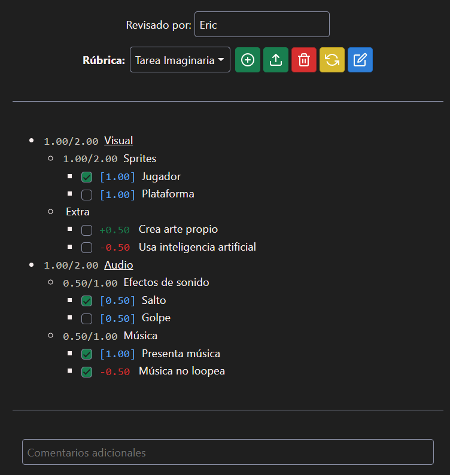
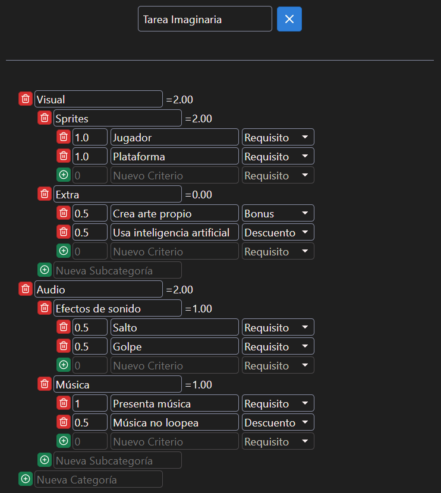
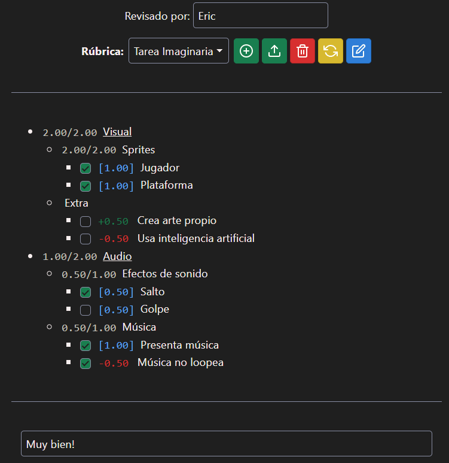
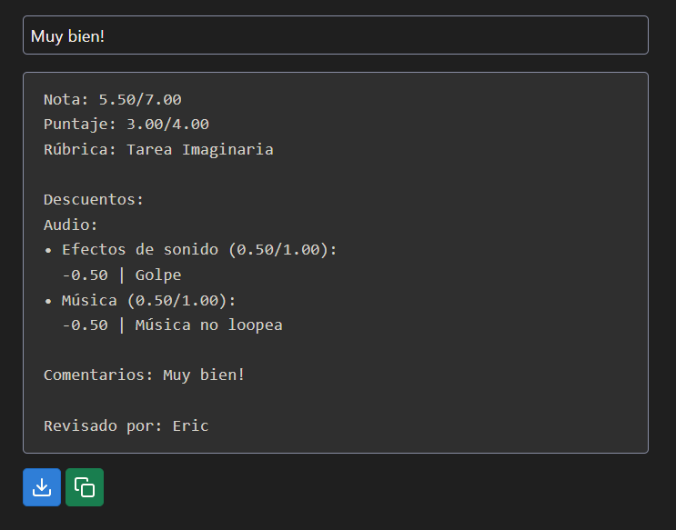

# Rubricator3000

    <a href="https://nyveon.github.io/rubricator3000/">>Disponible online<</a>

Sistema de creación y aplicación de rúbricas evaluativas.

Creado como herramienta de apoyo docente para el curso CC5408 - Taller de Diseño y Desarrollo de Videojuegos.

| Modo revisión | Modo edición |
| ---------- | ---------- |
|  |  |

## Jerarquía

Una rúbrica se modela como un arbol donde:

- Cada rúbrica puede tener una a varias categorías.
- Cada categoría puede tener una a varias subcategorías.
- Cada subcategoría puede tener uno o varios criterios.

## Criterios

Los criterios son los items a evaluar, y afectan el cálculo del puntaje y la nota. Existen distintos tipos de criterio, con distintos efectos en el cálculo del puntaje:

|                       | Afecta total posible | No afecta total posible |
| --------------------- | -------------------- | ----------------------- |
| Afecta cálculo local  | + Requisito (azul)     |  - Descuento (rojo)       |
| Afecta cálculo global | N/A                  |  + Bonus (verde)          |

## Output

Marcar criterios genera un output dinámico. El formato es:

1. Nota final y Puntaje calculado
2. Nombre de rúbrica
3. **Descuentos (Requisitos no marcados y descuentos marcados)*
4. **Bonos (Bonus marcados)*
5. **Comentarios*
6. Nombre revisor

**: Solo se incluyen estas secciones si es que tienen contenido, si no, se omiten.*

El resultado se puede copiar directo al portapapeles.

### Ejemplo

| Evaluación | Output     |
| ---------- | ---------- |
|  |  |

## Import/Export

Rúbricas se puede exportar e importar como json. Esto incluye las marcas en los criterios, así que exportar una rúbrica sin marcas es como exportar un template, y exportar uno con marcas es como exportar la evaluación en sí.

## Detalles y consideraciones

- Todas los puntajes se truncan a dos decimales, y todas las notas se truncan a un decimal luego de ser calculados. Redondear queda como responsabilidad del sistema de notas o del ayudante revisor.
- La jerarquía es fija (categoria->subcategoría->criterio) por simplicidad.
- Hay poca validación de los campos de input al editar una rúbrica.
- ⚠ Las rubricas y evaluaciones se guardan en local storage, por lo que si limpias los cookies o cambias de navegador no persistirán. Siempre se debe respaldar como json!
